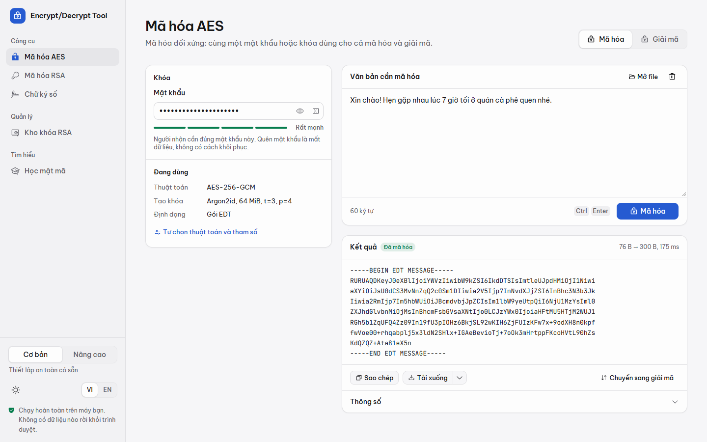
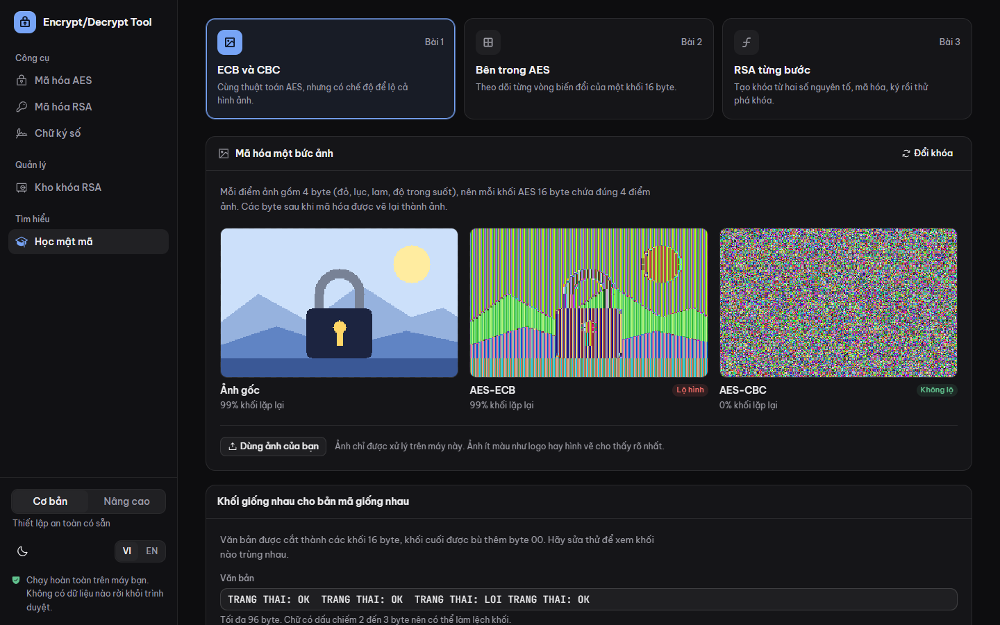
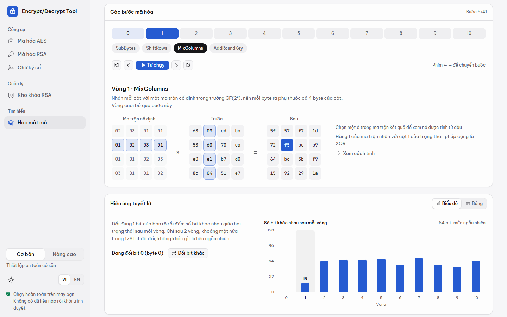

# Encrypt/Decrypt Tool

Công cụ mã hóa và giải mã văn bản, file bằng **AES** và **RSA**, từ thiết lập an toàn có sẵn đến tùy chỉnh từng tham số. Mọi thứ chạy ngay trong trình duyệt trên máy bạn: không có máy chủ, không cần tài khoản, không gửi dữ liệu đi đâu.

**Dùng ngay trên web:** https://novwyatt.github.io/encrypt-decrypt-tool/ (không cần cài đặt).



Công tắc **Cơ bản / Nâng cao** ở cuối thanh bên (trên điện thoại nằm trong menu) áp dụng cho toàn bộ ứng dụng. Mức Cơ bản chỉ hỏi những gì cần thiết và tự chọn thuật toán an toàn; mức Nâng cao mở ra đầy đủ chế độ, hàm tạo khóa và định dạng.

## Tính năng

### Mã hóa AES

- **Cơ bản:** chỉ cần mật khẩu. Dữ liệu được mã hóa bằng AES-256-GCM, khóa tạo từ mật khẩu bằng Argon2id (64 MiB, 3 vòng, 4 luồng), kết quả là một gói EDT tự ghi lại tham số.
- **Nâng cao:**
  - Chế độ GCM, CBC, CTR hoặc ECB, khóa 128, 192 hoặc 256 bit.
  - Tạo khóa từ mật khẩu bằng Argon2id, scrypt hoặc PBKDF2 với tham số tùy chỉnh, có cảnh báo khi thấp hơn khuyến nghị. Cũng có thể dùng khóa thô dạng hex hoặc base64.
  - HMAC-SHA256 (Encrypt-then-MAC) để chống sửa đổi với CBC và CTR, dữ liệu xác thực kèm (AAD) với GCM, tự đặt IV.
  - Ba định dạng đầu ra: gói EDT, tương thích `openssl enc` và CryptoJS (`Salted__`), hoặc bản mã thô dạng base64 hay hex.
- Tự nhận dạng loại bản mã khi dán hoặc thả file vào. Với file OpenSSL, ứng dụng tự thử các cấu hình phổ biến (AES-CBC 128, 192 hoặc 256 bit, tạo khóa bằng PBKDF2 hoặc MD5 kiểu cũ).
- Khi mã hóa ở định dạng OpenSSL, ứng dụng hiện sẵn lệnh `openssl` để giải mã file tải về.

### Kho khóa RSA

- Tạo cặp khóa 2048, 3072 (khuyên dùng) hoặc 4096 bit ngay trong trình duyệt. Mức Nâng cao có thêm 1024 bit (chỉ để học) và cho tự chọn số mũ công khai e.
- Nhập khóa PEM (SPKI, PKCS#1, PKCS#8, PKCS#8 có mật khẩu, PEM cũ có mật khẩu), JWK, OpenSSH, chứng chỉ X.509 hoặc DER.
- Xuất khóa công khai dạng SPKI, PKCS#1, OpenSSH, JWK và khóa riêng dạng PKCS#8, PKCS#1, JWK, hoặc PKCS#8 bảo vệ bằng mật khẩu (AES-256-CBC, PBKDF2-SHA256 600.000 vòng) mà OpenSSL mở được.
- Xem vân tay SHA-256 và các thành phần toán học n, e, d, p, q.

### Mã hóa RSA

- **Cơ bản:** mã hóa lai RSA-OAEP + AES-256-GCM. RSA bọc một khóa AES ngẫu nhiên, AES mã hóa dữ liệu, nên mã hóa được cả file lớn. Gửi được cho tối đa 32 người nhận cùng lúc, mỗi người tự giải mã bằng khóa riêng của mình.
- **Nâng cao:** chọn hàm băm OAEP (SHA-256, SHA-384, SHA-512 hoặc SHA-1), hoặc dùng RSA-OAEP trực tiếp cho dữ liệu ngắn và xuất bản mã thô tương thích `openssl pkeyutl`.
- Khi giải mã, khóa riêng khớp với người nhận được chọn tự động từ kho khóa.

### Chữ ký số

- **Cơ bản:** ký bằng RSA-PSS với SHA-256, xuất gói EDT. Gói ghi kèm lược đồ, hàm băm và mã khóa, nên khi xác minh ứng dụng tự tìm đúng khóa công khai trong kho.
- **Nâng cao:** chọn RSA-PSS hoặc RSASSA-PKCS1-v1_5, hàm băm và độ dài salt; xuất chữ ký thô tương thích `openssl dgst`. Khi xác minh chữ ký RSA-PSS thô có thể để ứng dụng tự dò độ dài salt.
- Sửa dù chỉ một ký tự của nội dung, chữ ký sẽ báo không hợp lệ.

### Học mật mã

Ba bài thực hành tương tác, chạy bằng chính dữ liệu bạn nhập:

1. **ECB và CBC:** mã hóa một bức ảnh (có sẵn hoặc ảnh của bạn) để thấy ECB để lộ hình còn CBC thì không, kèm bảng so sánh các khối văn bản trùng nhau. Mức Nâng cao có thêm CTR.
2. **Bên trong AES:** đi qua từng bước SubBytes, ShiftRows, MixColumns, AddRoundKey của mọi vòng, chọn một ô để xem nó được tính từ đâu, xem hiệu ứng tuyết lở và lịch mở rộng khóa. Kết quả được đối chiếu với thư viện AES chuẩn.
3. **RSA từng bước:** tạo khóa từ hai số nguyên tố, tính d bằng thuật toán Euclid mở rộng, mã hóa, ký, rồi phá khóa nhỏ bằng thuật toán rho của Pollard.





### Trải nghiệm sử dụng

- Tiếng Việt và tiếng Anh; giao diện sáng, tối hoặc theo hệ thống.
- Dùng tốt trên điện thoại và máy tính bảng.
- Dán văn bản hoặc kéo thả file (tối đa 128 MB), nhấn `Ctrl` + `Enter` (`⌘` + `Enter` trên macOS) để chạy nhanh.
- Mỗi trang chỉ tải khi cần. Phần tính toán nặng như Argon2id hay tạo khóa RSA chạy trong Web Worker nên giao diện không bị đứng.

## Bảo mật và quyền riêng tư

- **Không có máy chủ.** Mọi phép tính diễn ra trong trình duyệt. Font chữ và thư viện được đóng gói sẵn, trang không tải gì từ bên ngoài.
- **Header bảo mật:** bản dựng kèm file `_headers` (Cloudflare Pages và Netlify đọc được). File này đặt Content-Security-Policy chỉ cho chạy script của chính trang và chỉ cho kết nối về chính địa chỉ của nó, cấm trang khác nhúng công cụ vào iframe, và cho trình duyệt giữ lâu các file đã có mã băm trong tên.
- **Lưu gì trên máy:** chỉ các lựa chọn giao diện, tham số thuật toán và **khóa công khai** (trong `localStorage`). Mật khẩu, khóa riêng và nội dung văn bản không bao giờ được lưu.
- **Khóa riêng chỉ nằm trong bộ nhớ** của tab đang mở và mất khi tải lại trang. Hãy tải xuống, tốt nhất ở dạng có mật khẩu bảo vệ, để giữ lại.
- **Thư viện:** dùng WebCrypto của trình duyệt khi có thể. AES-192 và ECB (WebCrypto không hỗ trợ) dùng [@noble/ciphers](https://github.com/paulmillr/noble-ciphers); Argon2id và scrypt dùng [hash-wasm](https://github.com/Daninet/hash-wasm).
- **Chống sửa đổi:** với bản mã EDT, phần đầu chứa tham số được ràng buộc vào dữ liệu (làm dữ liệu xác thực của GCM, nằm trong HMAC, hoặc làm nhãn OAEP), nên sửa bất kỳ tham số nào cũng làm giải mã thất bại. Tham số tạo khóa đọc từ file bị giới hạn để không thể lợi dụng làm treo máy.
- **Mật khẩu tiếng Việt** được chuẩn hóa Unicode NFC, nên cùng một mật khẩu gõ từ các bộ gõ khác nhau vẫn cho cùng một khóa. Riêng định dạng OpenSSL dùng nguyên byte UTF-8 như chính OpenSSL.
- **Bài học chỉ để học:** mục Học mật mã dùng bản cài đặt AES và RSA viết riêng để hiện từng bước, không dùng cho các công cụ mã hóa.

> [!IMPORTANT]
> Dự án chưa qua kiểm toán bảo mật độc lập. Với dữ liệu thật sự quan trọng, hãy cân nhắc dùng thêm các công cụ đã được kiểm chứng lâu năm như OpenSSL, age hoặc GnuPG.

## Làm việc cùng OpenSSL

Bộ test chạy các lệnh dưới đây với OpenSSL thật để bảo đảm hai bên đọc được dữ liệu của nhau. Tên file chỉ là ví dụ.

Giải mã file tải về từ định dạng OpenSSL (ứng dụng cũng hiện sẵn lệnh này bên dưới kết quả):

```bash
openssl enc -d -aes-256-cbc -pbkdf2 -iter 10000 -in tin-nhan.enc -out tin-nhan.txt
```

Mã hóa bằng OpenSSL rồi thả file vào trang Mã hóa AES để giải mã. Thêm `-a` nếu muốn bản mã base64 để dán dạng văn bản:

```bash
openssl enc -aes-256-cbc -pbkdf2 -iter 10000 -salt -in tin-nhan.txt -out tin-nhan.enc
```

Giải mã bản mã RSA-OAEP thô (hàm băm SHA-256) bằng khóa riêng đã xuất:

```bash
openssl pkeyutl -decrypt -inkey khoa-rieng.pem -in ban-ma.bin -out ban-ro.txt \
  -pkeyopt rsa_padding_mode:oaep -pkeyopt rsa_oaep_md:sha256 -pkeyopt rsa_mgf1_md:sha256
```

Xác minh chữ ký RSA-PSS thô (SHA-256, salt 32 byte):

```bash
openssl dgst -sha256 -verify khoa-cong-khai.pem -sigopt rsa_padding_mode:pss \
  -sigopt rsa_pss_saltlen:32 -signature tai-lieu.txt.sig tai-lieu.txt
```

## Định dạng gói EDT

Gói EDT là định dạng mặc định. Nó ghi kèm mọi tham số cần thiết, nên người nhận chỉ cần mật khẩu hoặc khóa.

```text
"EDT" | phiên bản (1 byte) | độ dài phần đầu N (2 byte, big-endian) | phần đầu JSON (N byte) | dữ liệu
```

Ví dụ phần đầu của một bản mã AES dùng mật khẩu:

```json
{
  "type": "aes",
  "mode": "GCM",
  "keyBits": 256,
  "iv": "…",
  "key": {
    "source": "password",
    "kdf": { "name": "Argon2id", "memoryKiB": 65536, "iterations": 3, "parallelism": 4, "salt": "…" }
  }
}
```

- `type` là `aes`, `rsa-hybrid`, `rsa` hoặc `signature`.
- Gói RSA và chữ ký ghi mã khóa (`keyId`): 8 byte đầu, dạng hex, của vân tay SHA-256 khóa công khai.
- Khi hiển thị dạng văn bản, gói được bọc giữa `-----BEGIN EDT MESSAGE-----` hoặc `-----BEGIN EDT SIGNATURE-----` và dòng `END` tương ứng, nội dung ở dạng base64. Có thể tải về cả dạng văn bản lẫn nhị phân.
- Với CBC và CTR có HMAC, khóa mã hóa và khóa HMAC được tách ra từ khóa gốc bằng HKDF-SHA256.
- Khi không có gì xác thực dữ liệu (CBC hoặc CTR không HMAC, ECB), gói ghi thêm 4 byte kiểm tra khóa, cũng tách bằng HKDF, để báo sai mật khẩu thay vì trả ra dữ liệu rác.

## Cài đặt và chạy

Cần [Node.js](https://nodejs.org) 22.12 trở lên.

```bash
npm install
npm run dev
```

Mở địa chỉ mà Vite in ra, mặc định là http://localhost:5173.

Tạo bản dựng tĩnh trong thư mục `dist/` và xem thử:

```bash
npm run build
npm run preview
```

`dist/` chạy được trên bất kỳ máy chủ web tĩnh nào, kể cả khi đặt trong thư mục con (ví dụ GitHub Pages của một repo), vì ứng dụng dùng đường dẫn tương đối và định tuyến bằng dấu `#`. Trình duyệt không cho mở thẳng file `index.html` từ ổ đĩa (`file://`), nên hãy dùng `npm run preview` hoặc một máy chủ tĩnh.

Mỗi lần có commit mới trên nhánh `main`, GitHub Actions chạy bộ test, dựng lại và đăng bản mới lên GitHub Pages ([.github/workflows/deploy.yml](.github/workflows/deploy.yml)). Nếu test không qua, trang giữ nguyên bản cũ.

## Kiểm tra chất lượng

| Lệnh                   | Việc làm                                   |
| ---------------------- | ------------------------------------------ |
| `npm test`             | Chạy bộ test bằng Vitest                   |
| `npm run typecheck`    | Kiểm tra kiểu TypeScript                   |
| `npm run lint`         | Kiểm tra mã bằng oxlint                    |
| `npm run format:check` | Kiểm tra định dạng mã bằng Prettier        |

Bộ test đối chiếu với:

- Vector chuẩn: NIST SP 800-38A (AES-CBC, CTR, ECB), các ca kiểm thử AES-GCM của McGrew và Viega, RFC 7914 (scrypt), vector PBKDF2 kiểu RFC 6070, FIPS-197 phụ lục B và C (AES từng vòng).
- OpenSSL qua `node:crypto` với dữ liệu ngẫu nhiên, và lệnh `openssl` thật cho `enc`, `pkeyutl`, `dgst`, khóa có mật khẩu và chứng chỉ X.509. Nhóm test dùng lệnh `openssl` tự bỏ qua nếu máy chưa cài; có thể chỉ đường dẫn qua biến môi trường `OPENSSL_BIN`.
- Các tình huống lỗi: sai mật khẩu, bản mã hoặc phần đầu bị sửa, thiếu AAD, tham số tạo khóa độc hại.

## Công nghệ

Toàn bộ là phần mềm mã nguồn mở, miễn phí.

- **Giao diện:** React 19, TypeScript, Vite, Tailwind CSS 4, shadcn/ui trên nền Radix UI, Motion, Phosphor Icons, Sonner, font Be Vietnam Pro và JetBrains Mono.
- **Mật mã:** WebCrypto, @noble/ciphers, @noble/hashes, hash-wasm, Comlink (Web Worker), Zod (kiểm tra phần đầu gói EDT).
- **Công cụ:** Vitest, oxlint, Prettier.

## Cấu trúc thư mục

```text
src/
├── app/          Định tuyến bằng dấu #
├── components/   Thành phần giao diện dùng chung: bố cục, ô nhập liệu, kết quả, shadcn/ui
├── features/     Các trang: aes, rsa, sign, keys, learn
├── hooks/        Hook React dùng chung
├── i18n/         Bản dịch tiếng Việt và tiếng Anh
├── lib/          Đọc và tải file, định dạng số liệu, đánh giá và sinh mật khẩu
│   └── crypto/   Lõi mật mã chạy trong Web Worker, kèm bộ test
└── stores/       Cài đặt, giao diện sáng tối, kho khóa
```

## Giấy phép

Mã nguồn phát hành theo giấy phép [MIT](LICENSE): được dùng, sửa và chia sẻ lại tự do, kể cả cho mục đích thương mại, miễn là giữ lại thông báo bản quyền. Các thư viện đi kèm giữ giấy phép riêng của chúng.
